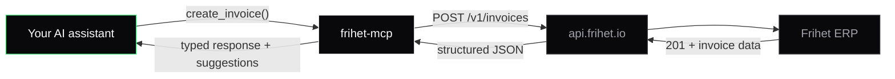

<p align="center">
  <picture>
    <source media="(prefers-color-scheme: dark)" srcset="./assets/banner.svg">
    <source media="(prefers-color-scheme: light)" srcset="./assets/banner-light.svg">
    
  </picture>
</p>

<p align="center">
  <strong>AI-native MCP server for business management.</strong><br/>
  <em>Servidor MCP nativo con IA para gestión empresarial.</em>
</p>

<p align="center">
  <a href="https://www.npmjs.com/package/@frihet/mcp-server"></a>
  <a href="https://www.npmjs.com/package/@frihet/mcp-server"></a>
  <a href="https://smithery.ai/server/frihet/frihet-mcp"></a>
  <a href="https://registry.modelcontextprotocol.io/servers/io.github.berthelius/frihet"></a>
  <a href="https://github.com/Frihet-io/frihet-mcp/blob/main/LICENSE"></a>
  
  =18">
  <a href="https://www.typescriptlang.org/"></a>
</p>

---

## What is this

An MCP server that connects your AI assistant to [Frihet](https://frihet.io). Create invoices by talking. Query expenses in natural language. Manage your entire business from your IDE.

```
You:     "Create an invoice for TechStart SL, 40 hours of consulting at 75 EUR/hour, due March 1st"
Claude:  Done. Invoice INV-2026-089 created. Total: 3,000.00 EUR + 21% IVA = 3,630.00 EUR.
```

35 tools. 8 resources. 7 prompts. Structured output on every tool. Zero boilerplate.

---

## Install

### One-line (Claude Code, Cursor, Copilot, Codex, Windsurf, Gemini CLI, and more)

```bash
npx skills add Frihet-io/frihet-mcp
```

### Claude Code / Claude Desktop

```json
{
  "mcpServers": {
    "frihet": {
      "command": "npx",
      "args": ["-y", "@frihet/mcp-server"],
      "env": {
        "FRIHET_API_KEY": "fri_your_key_here"
      }
    }
  }
}
```

| Tool | Config file |
|------|------------|
| Claude Code | `~/.claude/mcp.json` |
| Claude Desktop | `~/Library/Application Support/Claude/claude_desktop_config.json` |
| Cursor | `.cursor/mcp.json` or `~/.cursor/mcp.json` |
| Windsurf | `~/.windsurf/mcp.json` |
| Cline | VS Code settings or `.cline/mcp.json` |
| Codex CLI | `~/.codex/config.toml` (MCP section) |

The JSON config is identical for all tools. Only the file path changes.

### Remote (no install)

Use the hosted endpoint at `mcp.frihet.io` -- zero local dependencies, runs on Cloudflare Workers.

**With API key:**

```json
{
  "mcpServers": {
    "frihet": {
      "type": "streamable-http",
      "url": "https://mcp.frihet.io/mcp",
      "headers": {
        "Authorization": "Bearer fri_your_key_here"
      }
    }
  }
}
```

**With OAuth 2.0 + PKCE** (browser-based login, no API key needed):

Clients that support OAuth (Claude Desktop, Smithery, etc.) can connect directly to `https://mcp.frihet.io/mcp` and authenticate via browser. The server implements the full OAuth 2.1 authorization code flow with PKCE.

### Get your API key

1. Log into [app.frihet.io](https://app.frihet.io)
2. Go to **Settings > API**
3. Click **Create API key**
4. Copy the key (starts with `fri_`) -- it's only shown once

---

## What you can do

Talk to your ERP. These are real prompts, not marketing copy.

### Invoicing

```
"Show me all unpaid invoices"
"Create an invoice for Acme SL with 10h of consulting at 95/hour"
"Mark invoice abc123 as paid"
"How much has ClientName been invoiced this year?"
```

### Expenses

```
"Log a 59.99 EUR expense for Adobe Creative Cloud, category: software, tax-deductible"
"List all expenses from January"
"What did I spend on travel last quarter?"
```

### Clients

```
"Add a new client: TechStart SL, NIF B12345678, email admin@techstart.es"
"Show me all my clients"
"Update ClientName's address to Calle Mayor 1, Madrid 28001"
```

### Quotes

```
"Create a quote for Design Studio: logo design (2000 EUR) + brand guidelines (3500 EUR)"
"Show me all pending quotes"
```

### Webhooks

```
"Set up a webhook to notify https://my-app.com/hook when invoices are paid"
"List all my active webhooks"
```

---

## What to expect

This MCP is a **structured data interface** -- you describe what you want in natural language, and the AI creates, queries, or modifies business records in Frihet. All 35 tools are CRUD operations over the REST API.

**Works great:**

```
"Create an invoice for TechStart SL, 40h consulting at 75 EUR/h"   --> creates the invoice
"Show unpaid invoices over 1,000 EUR"                               --> queries and filters
"Log a 120 EUR expense for the Madrid train, category: travel"      --> records the expense
"Update client Acme's email to billing@acme.es"                     --> modifies the record
```

**Does not do:**

- OCR or PDF scanning -- you cannot upload an invoice image and have it read
- File upload or attachment handling
- Image processing of any kind

If you need to digitize paper invoices or receipts, extract the data first (e.g., Claude Vision API, a dedicated OCR service, or manual entry), then use the MCP to create the record:

```
1. Scan/photograph the invoice
2. Use Claude Vision: "Read this invoice image and extract the vendor, items, amounts, and dates"
3. Then: "Create an expense in Frihet for [extracted data]"
```

---

## Tools (35)

### Invoices (6)

| Tool | What it does |
|------|-------------|
| `list_invoices` | List invoices with pagination |
| `get_invoice` | Get full invoice details by ID |
| `create_invoice` | Create a new invoice with line items |
| `update_invoice` | Update any invoice field |
| `delete_invoice` | Permanently delete an invoice |
| `search_invoices` | Find invoices by client name |

### Expenses (5)

| Tool | What it does |
|------|-------------|
| `list_expenses` | List expenses with pagination |
| `get_expense` | Get expense details |
| `create_expense` | Record a new expense |
| `update_expense` | Modify an expense |
| `delete_expense` | Delete an expense |

### Clients (5)

| Tool | What it does |
|------|-------------|
| `list_clients` | List all clients |
| `get_client` | Get client details |
| `create_client` | Register a new client |
| `update_client` | Update client info |
| `delete_client` | Remove a client |

### Products (5)

| Tool | What it does |
|------|-------------|
| `list_products` | List products and services |
| `get_product` | Get product details |
| `create_product` | Add a product or service |
| `update_product` | Update pricing or details |
| `delete_product` | Remove a product |

### Quotes (5)

| Tool | What it does |
|------|-------------|
| `list_quotes` | List all quotes |
| `get_quote` | Get quote details |
| `create_quote` | Draft a new quote |
| `update_quote` | Modify a quote |
| `delete_quote` | Delete a quote |

### Webhooks (5)

| Tool | What it does |
|------|-------------|
| `list_webhooks` | List configured webhooks |
| `get_webhook` | Get webhook details |
| `create_webhook` | Register a new webhook endpoint |
| `update_webhook` | Modify events or URL |
| `delete_webhook` | Remove a webhook |

### Intelligence (4)

| Tool | What it does |
|------|-------------|
| `get_business_context` | Full snapshot: profile, plan, recent activity, top clients, current month |
| `get_monthly_summary` | Monthly P&L: revenue, expenses, profit, tax liability, top clients by revenue |
| `get_quarterly_taxes` | Quarterly tax prep: Modelo 303/130 fields, collected vs deductible, liability |
| `duplicate_invoice` | Clone an invoice for recurring billing (copies items/client/tax, starts as draft) |

All 35 tools return **structured output** via `outputSchema` -- typed JSON, not raw text. List tools return paginated results (`{ data, total, limit, offset }`).

---

## Resources (8)

Context the AI can read to make smarter decisions.

**Static** (reference data, no API calls):

| Resource | URI | What it provides |
|----------|-----|-----------------|
| API Schema | `frihet://api/schema` | OpenAPI summary: endpoints, auth, rate limits, pagination, error codes |
| Tax Rates | `frihet://tax/rates` | Tax rates by Spanish fiscal zone: IVA, IGIC, IPSI, EU reverse charge, IRPF |
| Tax Calendar | `frihet://tax/calendar` | Quarterly filing deadlines: Modelo 303, 130, 390, 420, VeriFactu timeline |
| Expense Categories | `frihet://config/expense-categories` | 8 categories with deductibility rules, IVA treatment, amortization |
| Invoice Statuses | `frihet://config/invoice-statuses` | Status flow (draft > sent > paid/overdue > cancelled), transition rules, webhook events |

**Dynamic** (live data from your account):

| Resource | URI | What it provides |
|----------|-----|-----------------|
| Business Profile | `frihet://business-profile` | Your business info, plan, defaults, recent activity, top clients |
| Monthly Snapshot | `frihet://monthly-snapshot` | Current month P&L, revenue, expenses, tax liability |
| Overdue Invoices | `frihet://overdue-invoices` | All invoices past due date (up to 100) |

---

## Prompts (7)

Pre-built workflows the AI can execute as guided multi-step operations.

| Prompt | What it does | Arguments |
|--------|-------------|-----------|
| `monthly-close` | Close the month: review unpaid invoices, categorize expenses, check tax obligations, generate summary | `month?` (YYYY-MM) |
| `onboard-client` | Set up a new client with correct tax rates by location, optionally create a welcome quote | `clientName`, `country?`, `region?` |
| `quarterly-tax-prep` | Prepare quarterly tax filing: calculate IVA/IGIC, identify deductibles, preview Modelo 303/130/420 | `quarter?`, `fiscalZone?` |
| `overdue-followup` | Find overdue invoices, draft follow-up messages, suggest payment reminders | -- |
| `new-client-invoice` | Create a client + first invoice in one workflow with tax rate lookup | `clientName`, `country?` |
| `expense-report` | Generate expense report grouped by category with deductible totals | `month?` (YYYY-MM) |
| `expense-batch` | Process expenses in bulk: categorize, apply tax rates, flag missing receipts | `fiscalZone?` |

---

## How it works



The server translates tool calls into REST API requests. It handles authentication, rate limiting (automatic retry with backoff on 429), pagination, and error mapping.

Two transports:
- **stdio** (local) -- `npx @frihet/mcp-server` with `FRIHET_API_KEY`
- **Streamable HTTP** (remote) -- `https://mcp.frihet.io/mcp` with Bearer token or OAuth 2.0+PKCE

### Environment variables

| Variable | Required | Default |
|----------|----------|---------|
| `FRIHET_API_KEY` | Yes (stdio) | -- |
| `FRIHET_API_URL` | No | `https://api.frihet.io/v1` |

---

## API limits

| Limit | Value |
|-------|-------|
| Requests per minute | 100 per API key |
| Results per page | 100 max (50 default) |
| Request body | 1 MB max |
| Webhook payload | 100 KB max |
| Webhooks per account | 20 max |

Rate limiting is handled automatically with exponential backoff.

---

## Claude Code Skill

Beyond raw MCP tools, this repo includes a **Claude Code skill** that adds business context: Spanish tax rules, workflow recipes, financial reports, and natural language commands.

### Install the skill

```bash
git clone https://github.com/Frihet-io/frihet-mcp.git
ln -s "$(pwd)/frihet-mcp/skill" ~/.claude/skills/frihet
```

Or with the universal installer:

```bash
npx skills add Frihet-io/frihet-mcp
```

### Commands

| Command | What it does |
|---------|-------------|
| `/frihet status` | Account overview, recent activity, pending payments |
| `/frihet invoice` | Create, list, search invoices |
| `/frihet expense` | Log and query expenses |
| `/frihet clients` | Manage client database |
| `/frihet quote` | Create and manage quotes |
| `/frihet report` | Financial summaries (P&L, quarterly, overdue) |
| `/frihet webhooks` | Configure automation triggers |
| `/frihet setup` | Guided setup and connection test |

The skill knows about IVA rates, IRPF retention, Modelo 303 prep, expense deductibility rules, and VeriFactu compliance.

Full documentation: [docs.frihet.io/desarrolladores/skill-claude-code](https://docs.frihet.io/desarrolladores/skill-claude-code)

---

## Development

```bash
git clone https://github.com/Frihet-io/frihet-mcp.git
cd frihet-mcp
npm install
npm run build
```

Run locally:

```bash
FRIHET_API_KEY=fri_xxx node dist/index.js
```

Test with the [MCP Inspector](https://modelcontextprotocol.io/docs/tools/inspector):

```bash
npx @modelcontextprotocol/inspector node dist/index.js
```

---

## Contributing

Contributions are welcome. Please open an issue first to discuss what you'd like to change.

```bash
git clone https://github.com/Frihet-io/frihet-mcp.git
cd frihet-mcp
npm install
npm run build   # must pass before submitting
```

---

## Current limitations

- **No OCR or file upload** -- the MCP works with structured data, not images or PDFs. Planned for a future release.
- **Single company** -- one API key maps to one Frihet workspace. Multi-company support is not yet available.
- **Frihet account required** -- you need an active account at [app.frihet.io](https://app.frihet.io) and an API key (starts with `fri_`).

---

## Ecosystem

| Package | What it is |
|---------|-----------|
| [`@frihet/mcp-server`](https://www.npmjs.com/package/@frihet/mcp-server) | This MCP server (35 tools, 8 resources, 7 prompts) |
| [`@frihet/sdk`](https://github.com/Frihet-io/frihet-sdk) | TypeScript SDK (`frihet.invoices.create()`) |
| [`frihet`](https://www.npmjs.com/package/frihet) | CLI (`frihet invoices list --status overdue`) |
| [REST API](https://docs.frihet.io/desarrolladores/api-rest) | OpenAPI 3.1 at `api.frihet.io/v1` |
| [Webhooks](https://docs.frihet.io/desarrolladores/webhooks) | Real-time events with HMAC-SHA256 |

## Links

- [Frihet](https://frihet.io) -- The product
- [Documentation](https://docs.frihet.io) -- Full docs
- [API reference](https://docs.frihet.io/desarrolladores/api-rest) -- REST API
- [MCP server docs](https://docs.frihet.io/desarrolladores/mcp-server) -- Setup guides, troubleshooting
- [npm](https://www.npmjs.com/package/@frihet/mcp-server) -- Package registry
- [MCP Registry](https://registry.modelcontextprotocol.io/servers/io.github.berthelius/frihet) -- Official MCP Registry
- [Smithery](https://smithery.ai/server/frihet/frihet-mcp) -- Smithery marketplace
- [Remote endpoint](https://mcp.frihet.io) -- Hosted MCP server (Cloudflare Workers)
- [OpenAPI spec](https://api.frihet.io/openapi.yaml) -- Machine-readable API definition

---

## License

MIT. See [LICENSE](./LICENSE).

Built by [Frihet](https://frihet.io).
