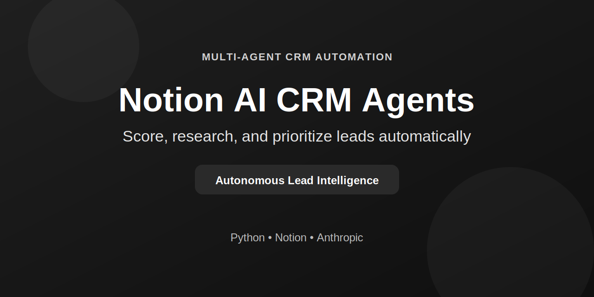
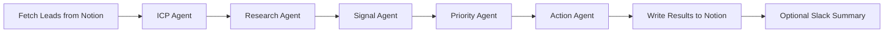

# Notion AI CRM Copilot

<p align="center">
  
</p>

<p align="center">
  <a href="LICENSE"></a>
  
  
  
  
</p>

Turn raw Notion leads into prioritized, actionable opportunities using a multi-agent AI pipeline.

## Why This Project

Sales teams usually lose time in three places:

- Lead research is manual and inconsistent.
- Qualification is subjective and hard to audit.
- Follow-up order is unclear when the pipeline gets busy.

This project automates that loop with explicit outputs you can review in Notion.

## What You Get

- ICP scoring with confidence and reasoning.
- Lightweight web enrichment (`website -> brave`) with citations.
- Signal detection for funding, intent, hiring, leadership, and tech initiatives.
- Priority tiering (`high`, `medium`, `low`, `review`) with stale lead flags.
- Action recommendation (`outreach_now`, `reengage`, `nurture`, `enrich_data`, `hold`).
- Incremental processing that skips unchanged, already-scored leads.

## 60-Second Quick Start

### 1. Install

```bash
git clone <your-repo-url>
cd notion-ai-crm
pip install -r requirements.txt
```

### 2. Configure (recommended)

```bash
python main.py --setup
```

The setup wizard will:

- Save/update `.env`.
- Validate Notion database access.
- Optionally auto-create missing output columns.

Manual option:

```bash
cp .env.example .env
```

Then set at least:

- `NOTION_API_KEY`
- `NOTION_DATABASE_ID`
- `CLAUDE_API_KEY`

### 3. Validate safely (no writes)

```bash
python main.py --dry-run --limit 2
```

### 4. Run on your CRM

```bash
python main.py
```

For Notion setup details, see [NOTION_SETUP.md](NOTION_SETUP.md).

## Pipeline Flow



## Agent Outputs

| Agent | Purpose | Primary Outputs |
|---|---|---|
| ICP Scoring | Score fit against your ICP rubric | `icp_score`, `confidence_score`, `icp_reasoning` |
| Market Research | Enrich lead context from website/search | `research_brief`, `research_confidence`, `research_citations`, `research_source_count`, `research_providers` |
| Signal Detection | Identify urgency/intent triggers | `signal_type`, `signal_strength`, `signal_date`, `signal_reasoning` |
| Prioritization | Convert evidence into work order | `priority_tier`, `priority_reasoning`, `stale_flag` |
| Action Recommendation | Recommend next move | `next_action`, `action_reasoning`, `action_confidence` |

## Command Cheat Sheet

| Command | What it does |
|---|---|
| `python main.py --setup` | Interactive setup wizard for `.env` + schema bootstrap |
| `python main.py --dry-run` | Runs on sample leads, skips Notion writes |
| `python main.py --limit 5` | Processes first 5 eligible leads |
| `python main.py --no-web` | Disables website/search enrichment |
| `python main.py --full-refresh` | Ignores incremental state and processes all leads |
| `python main.py --slack` | Sends run summary to Slack (needs `SLACK_WEBHOOK_URL`) |

## Notion Schema

### Expected input columns (defaults)

- `Company` (title)
- `Website` (url)
- `Notes` (rich_text)
- `Last Contacted` (date)
- `Status` (select)

### Output columns

If you use `--setup`, missing output columns can be auto-created. You can also map custom names in `.env` using `NOTION_PROP_*` variables.

## Configuration

### Core behavior

```dotenv
HIGH_ICP_MIN=75
HIGH_RECENCY_MAX=10
LOW_ICP_MAX=40
LOW_STALE_DAYS=45
STALE_DAYS_THRESHOLD=14
INCREMENTAL_ENABLED=true
PIPELINE_STATE_FILE=.pipeline_state.json
```

### Research controls

```dotenv
WEB_RESEARCH_ENABLED=true
WEB_RESEARCH_WATERFALL=website,brave
WEB_RESEARCH_TARGET_CHARS=4000
WEB_RESEARCH_RUN_ALL_PROVIDERS=false
BRAVE_SEARCH_API_KEY=
```

### Slack notifications

```dotenv
SLACK_ENABLED=false
SLACK_WEBHOOK_URL=
```

## Project Structure

```text
.
├── agents/                  # ICP, research, signals, priority, action agents
├── services/                # Notion, Claude, web research, Slack notifier
├── prompts/                 # Prompt templates per agent
├── tests/                   # Unit tests
├── main.py                  # CLI entrypoint
├── pipeline.py              # Orchestration logic
├── setup_wizard.py          # Interactive setup
└── config.py                # Environment-driven configuration
```

## Testing

Run the full suite:

```bash
pytest -q
```

## Troubleshooting

- `CLAUDE_API_KEY is missing`:
  - Add `CLAUDE_API_KEY=...` to `.env`.
- `Database not found`:
  - Verify `NOTION_DATABASE_ID` and share database with your integration.
- Leads processed but no updates written:
  - Ensure output properties exist (or rerun `python main.py --setup`).
- Unexpected skips in incremental mode:
  - Use `python main.py --full-refresh` to force a complete pass.

## Security Notes

- Keep `.env` local and never commit real keys.
- Use `.env.example` for placeholders only.
- Rotate keys immediately if they were ever exposed.

## License

MIT. See [LICENSE](LICENSE).
